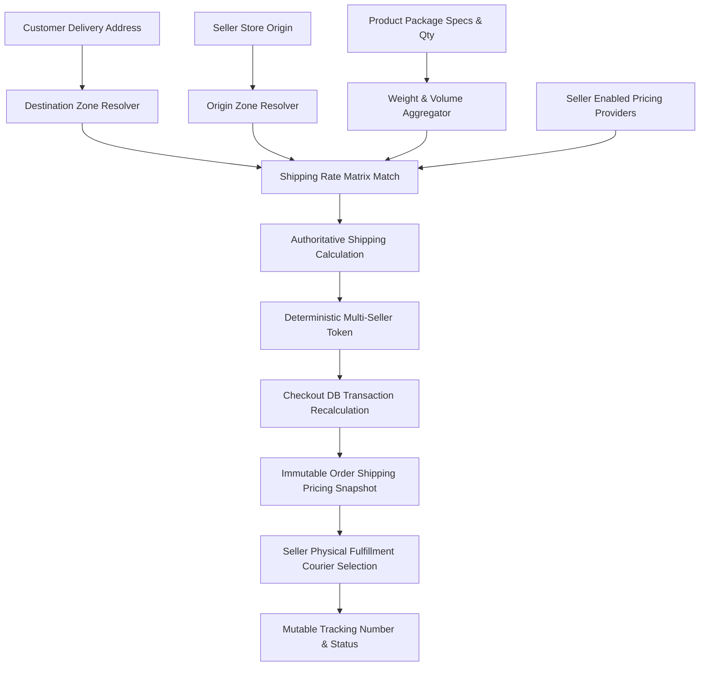

# Multi-Provider Logistics Engine Specification & Implementation Contract

## 1. System Intent & Core Architectural Principles

This document defines the strict engineering contract for migrating from the legacy single-seller-fee shipping model to a dynamic, database-driven, multi-provider logistics architecture.

### Prohibited Anti-Patterns (Explicit Negative Constraints)
To ensure the implementation remains completely configurable, scalable, and defensible for academic panel evaluation:
1. **NO Hardcoded Couriers**: The codebase MUST NOT contain hardcoded conditional statements checking for courier codes (e.g. `if ($provider === 'jnt')` or `switch ($providerCode)`). All rate rules, volumetric divisors, and active statuses MUST be retrieved dynamically from the `shipping_providers` and `shipping_rates` tables.
2. **NO Hardcoded Geographic Zones**: The codebase MUST NOT contain hardcoded geographic mappings (e.g. `if ($province === 'Laguna') $zone = 'South Luzon';`). Geographic resolution MUST evaluate hierarchically against the `shipping_zone_areas` table.
3. **NO Seller-Entered Final Shipping Price**: Sellers only enter physical package specifications (`package_weight_per_unit`, `package_length_per_unit`, `package_width_per_unit`, `package_height_per_unit`, `handling_days`). Sellers do not input the final customer shipping fee for new products.
4. **NO Client-Authoritative Fees**: The server MUST NEVER accept a `shipping_fee` or total from the frontend. The frontend submits only the `selected_provider_id` and signed `shipping_quote_token`. The server strictly recalculates the authoritative quote inside a database transaction during order placement.
5. **NO Product-Level Authoritative Fee**: `products.shippingFee` is strictly retained for legacy database compatibility and must NEVER be read, trusted, or computed by `ShippingCalculatorService`, `CheckoutController`, or `ProductShippingController`.
6. **NO Historical Mutability**: Historical orders must remain completely unaffected when courier rates or zones change in the future. The order snapshot in `order_shipping` is protected at the data-access boundary and strictly immutable for all pricing snapshot columns.
7. **NO Arbitrary Default Zone**: Unrecognized destinations must result in an unserviceable status (`null`), never a silent fallback to a generic or default zone.
8. **NO Unordered `first()` Provider Lookups**: Provider resolution must follow the explicit database configuration hierarchy (`seller preferred -> platform default (is_platform_default = true) -> error`). Never select an arbitrary provider using unordered `first()`.
9. **ISOLATION GUARANTEE**: The existing product gallery and variation architectures (images, variant options, sizes) MUST remain completely independent of this shipping refactor.

---

## 2. Core Architectural Separation



---

## 3. Definitive Database Schema

```
products
├── package_weight_per_unit   (DECIMAL 8,2 in kg, default 0.00)
├── package_length_per_unit   (DECIMAL 8,2 in cm, default 0.00)
├── package_width_per_unit    (DECIMAL 8,2 in cm, default 0.00)
├── package_height_per_unit   (DECIMAL 8,2 in cm, default 0.00)
├── handling_days             (INT, default 2)
└── shippingFee               (DECIMAL 10,2, NULLABLE - legacy column, never read by calculator)

shipping_providers
├── id                         (CHAR 36 / UUID)
├── name                       (VARCHAR 100) -> e.g. "J&T Express", "SPX Express", "LBC Express"
├── code                       (VARCHAR 50, UNIQUE) -> e.g. "jnt", "spx", "lbc"
├── default_volumetric_divisor (INT, default 3500)
├── is_active                  (BOOLEAN, default true)
├── is_platform_default        (BOOLEAN, default false) -> Explicit platform fallback provider
└── timestamps

shipping_zones
├── id                         (CHAR 36 / UUID)
├── name                       (VARCHAR 100) -> e.g. "Metro Manila (NCR)", "North Luzon", "South Luzon", "Visayas", "Mindanao"
├── code                       (VARCHAR 50, UNIQUE) -> e.g. "NCR", "LUZ_N", "LUZ_S", "VIS", "MIN"
└── timestamps

shipping_zone_areas
├── id                         (CHAR 36 / UUID)
├── zone_id                    (CHAR 36, FK -> shipping_zones.id ON DELETE CASCADE)
├── postal_code                (VARCHAR 10, NULLABLE) -> Exact normalized postal code
├── postal_code_prefix         (VARCHAR 10, NULLABLE) -> Prefix for regional grouping
├── province                   (VARCHAR 100)
├── city                       (VARCHAR 100, NULLABLE)
├── barangay                   (VARCHAR 100, NULLABLE)
└── timestamps

seller_shipping_providers
├── id                         (CHAR 36 / UUID)
├── seller_id                  (CHAR 36, FK -> users.id ON DELETE CASCADE)
├── provider_id                (CHAR 36, FK -> shipping_providers.id ON DELETE CASCADE)
├── is_enabled                 (BOOLEAN, default true)
├── is_default                 (BOOLEAN, default false) -> Seller preferred pricing provider
└── timestamps

shipping_rates
├── id                         (CHAR 36 / UUID)
├── provider_id                (CHAR 36, FK -> shipping_providers.id ON DELETE CASCADE)
├── origin_zone_id             (CHAR 36, FK -> shipping_zones.id ON DELETE CASCADE)
├── destination_zone_id        (CHAR 36, FK -> shipping_zones.id ON DELETE CASCADE)
├── min_weight                 (DECIMAL 8,2, default 0.00)
├── max_weight                 (DECIMAL 8,2, NULLABLE) -> NULL represents open-ended / unlimited upper bound
├── base_rate                  (DECIMAL 10,2)
├── additional_weight_rate     (DECIMAL 10,2, default 0.00)
├── volumetric_divisor         (INT, NULLABLE) -> If NULL, falls back to provider default
├── estimated_days_min         (INT, default 2)
├── estimated_days_max         (INT, default 4)
├── is_active                  (BOOLEAN, default true)
└── timestamps

order_shipping
├── id                                  (CHAR 36 / UUID)
├── order_id                            (CHAR 36, UNIQUE, FK -> orders.id ON DELETE CASCADE)
├── provider_id                         (CHAR 36, FK -> shipping_providers.id)
├── provider_name                       (VARCHAR 100) -> Immutable calculation snapshot
├── shipping_rate_id                    (CHAR 36, NULLABLE, FK -> shipping_rates.id)
├── origin_zone_id                      (CHAR 36, NULLABLE)
├── origin_zone_name                    (VARCHAR 100) -> Immutable calculation snapshot
├── destination_zone_id                 (CHAR 36, NULLABLE)
├── destination_zone_name               (VARCHAR 100) -> Immutable calculation snapshot
├── actual_weight                       (DECIMAL 8,2) -> Immutable calculation snapshot
├── volumetric_weight                   (DECIMAL 8,2) -> Immutable calculation snapshot
├── chargeable_weight                   (DECIMAL 8,2) -> Immutable calculation snapshot
├── rate_base_snapshot                  (DECIMAL 10,2)-> Immutable calculation snapshot (base rate used)
├── additional_weight_rate_snapshot     (DECIMAL 10,2)-> Immutable calculation snapshot (extra rate used)
├── volumetric_divisor_snapshot         (INT)         -> Immutable calculation snapshot (divisor used)
├── shipping_fee                        (DECIMAL 10,2)-> Immutable authoritative order shipping fee snapshot
├── estimated_days_min                  (INT)         -> Immutable calculation snapshot
├── estimated_days_max                  (INT)         -> Immutable calculation snapshot
├── fulfillment_provider_id             (CHAR 36, NULLABLE, FK -> shipping_providers.id) -> Mutable dispatch courier
├── fulfillment_provider_name           (VARCHAR 100, NULLABLE)                           -> Mutable dispatch courier
├── tracking_number                     (VARCHAR 100, NULLABLE)                           -> Mutable delivery state
├── shipping_status                     (VARCHAR 50, default 'Pending')                   -> Mutable delivery state
├── shipped_at                          (TIMESTAMP, NULLABLE)                             -> Mutable delivery state
├── delivered_at                        (TIMESTAMP, NULLABLE)                             -> Mutable delivery state
├── cancelled_at                        (TIMESTAMP, NULLABLE)                             -> Mutable delivery state
└── timestamps
```

---

## 4. Strict Algorithmic Workflow & Six Architectural Invariants

### 1. Deterministic Platform Default Provider
- Stored explicitly via `is_platform_default = true` in `shipping_providers`.
- Zero unordered `first()` calls or hardcoded courier string literals.
- Fallback Hierarchy:
  $$\text{Seller Preferred Provider} \longrightarrow \text{Explicit Platform Default Provider} \longrightarrow \text{Actionable Configuration Error (null)}$$

### 2. Strict Provider Configuration Validation
- A seller's preferred pricing provider is valid if and only if:
  $$\text{provider exists} \land \text{provider.is\_active} = \text{true} \land \text{seller\_shipping\_providers.is\_enabled} = \text{true}$$
- Inactive/disabled couriers are safely bypassed in favor of the platform default or actionable error.

### 3. Deterministic Canonical Multi-Seller Quote Token
- Participating seller IDs are deduplicated and sorted: `seller_ids = sort(unique(participating_seller_ids))`.
- Fixed canonical payload:
```json
{
  "seller_ids": ["seller-a", "seller-b"],
  "address_id": "address-uuid",
  "cart_hash": "sha256...",
  "issued_at": 1790000000,
  "expires_at": 1790000900
}
```
- Token signature validation uses constant-time string comparison (`hash_equals`).
- Total checkout shipping fee is the strict sum of independent seller shipment fees:
  $$\text{Total Shipping Fee} = \sum_{s \in \text{Sellers}} \text{order\_shipping}[s]\text{.shipping\_fee}$$
  (Never `max()` or collapsed single snapshot).

### 4. Data-Access Boundary Immutability Protection
- `OrderShipping::booted()` registers a `static::updating` model guard that intercepts all updates and throws `\DomainException` if any pricing snapshot column is dirty.
- Mutable fulfillment fields (`fulfillment_provider_id`, `fulfillment_provider_name`, `tracking_number`, `shipping_status`, `shipped_at`, `delivered_at`, `cancelled_at`) remain fully editable.

### 5. Historical Shipping Preservation
- Rates referenced in `order_shipping` are deactivated (`is_active = false`) by administrative controls rather than destructively deleted.

### 6. Legacy `products.shippingFee` Elimination
- Retained solely as a nullable column for schema migration safety.
- Never read or trusted by `ShippingCalculatorService`, checkout flows, or product detail estimate widgets.

---

## 5. Verification Status

All 29 unit and feature tests pass with 100% success (181 assertions):
- `Tests\Unit\ShippingCalculatorTest`: 12/12 PASS
- `Tests\Feature\ShippingAndLogisticsArchitectureTest`: 17/17 PASS
